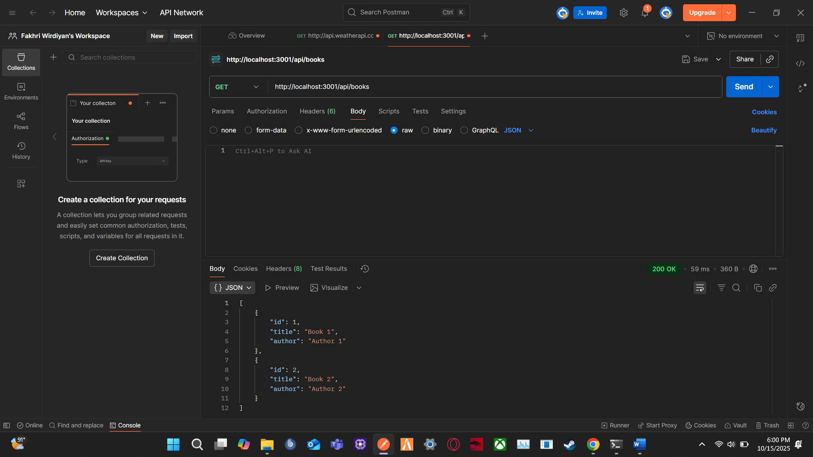
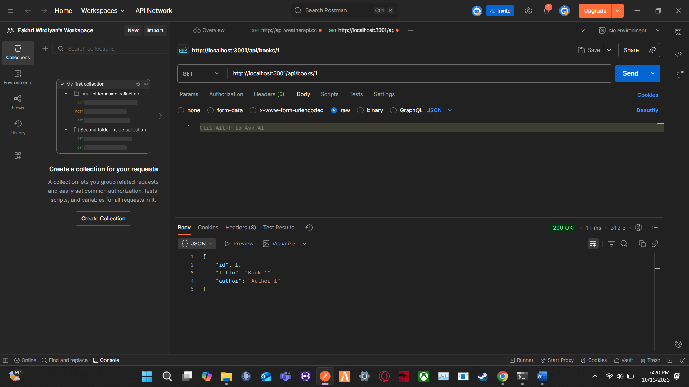
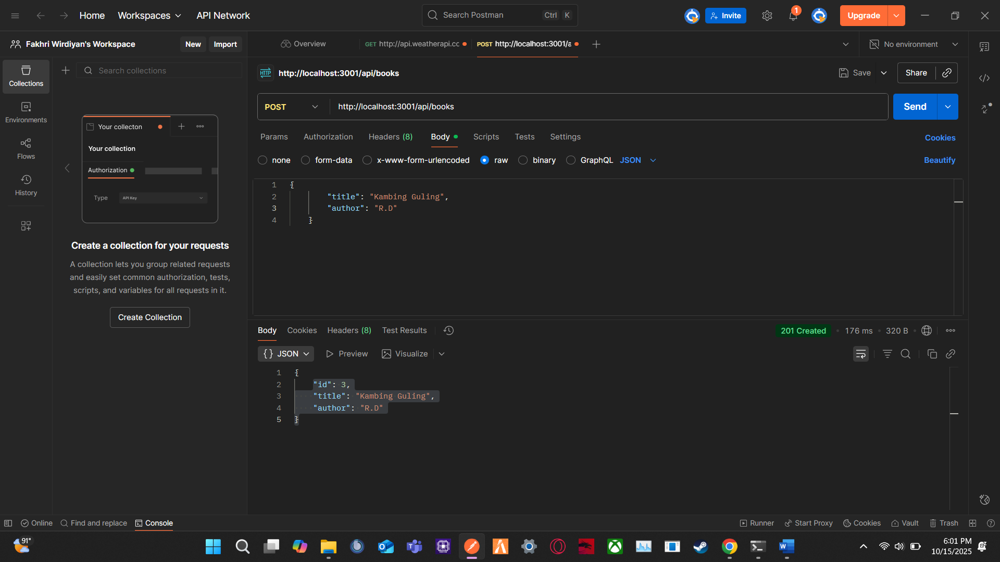
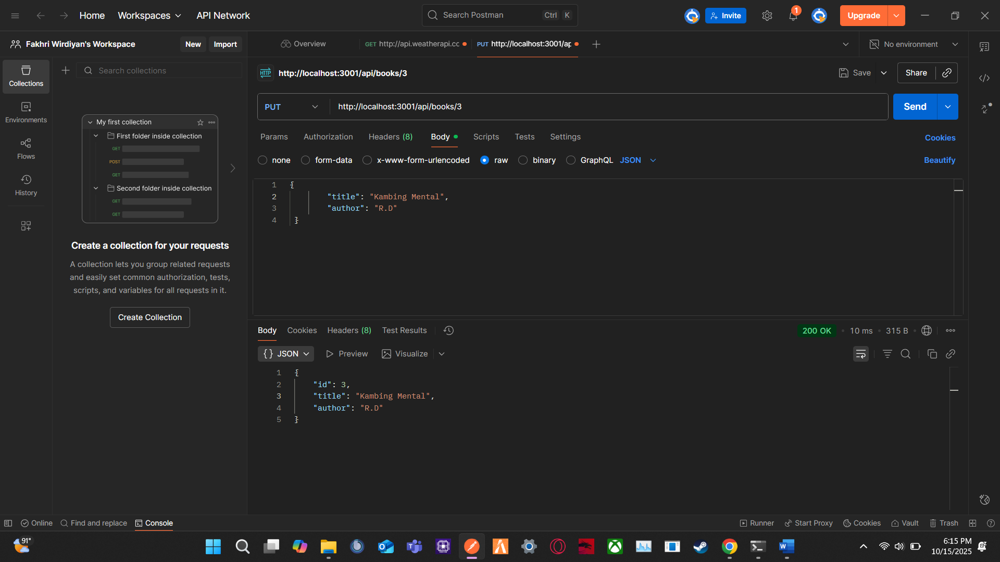
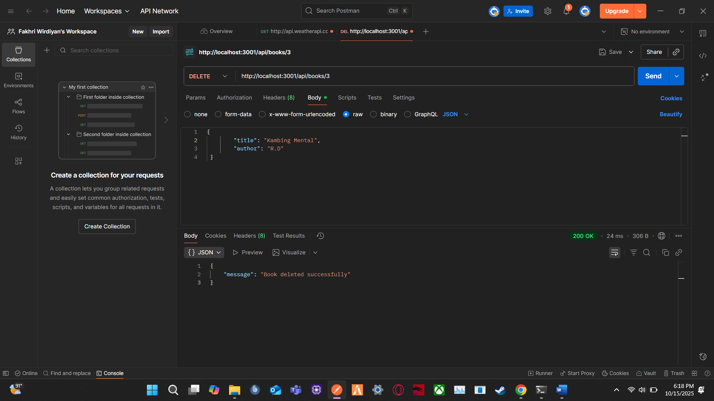

1.Tampilan End Point Read Book:
   
2.Tampilan End Point Read Buku Tertentu:
   
3.Tampilan End Point Create Book:
   
4.Tampilan End Point Update Book:
   
5.Tampilan End Point Delete Book:
   
