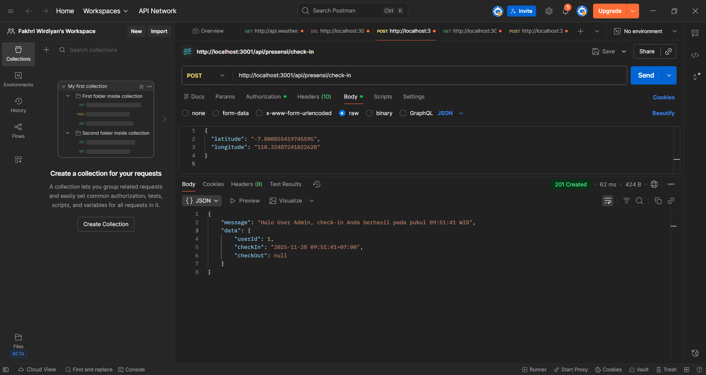
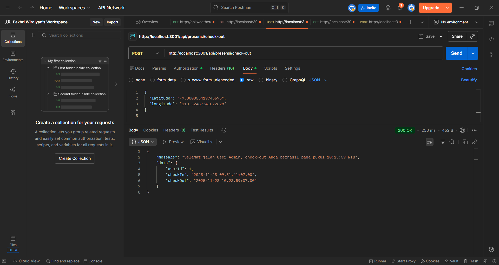
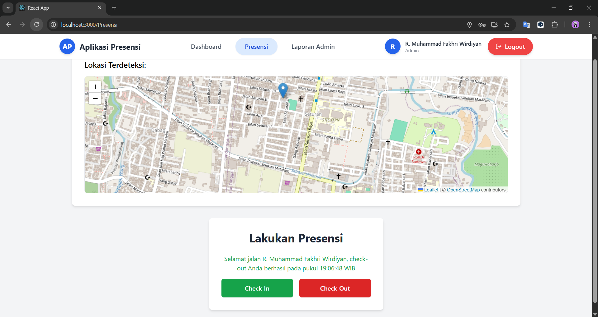
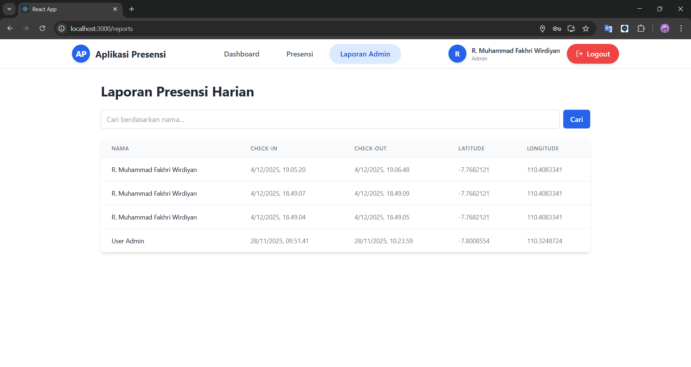
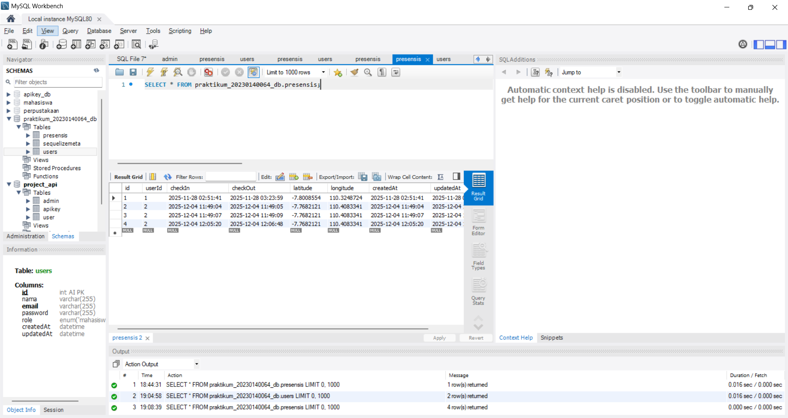

1.Endpoint presensi/check-in dengan menggunakan bearer token dan body latitude, longitude:
  
  
2.Tampilan halaman presensi dengan menampilkan maps OSM:
  a.Tampilan Check In User
  
  b.Tampilan Check Out User
  
3.Tampilan halaman report yg berisi data presensi dari semua user: 
  
4.Tampilan tabel presensi di database:
  